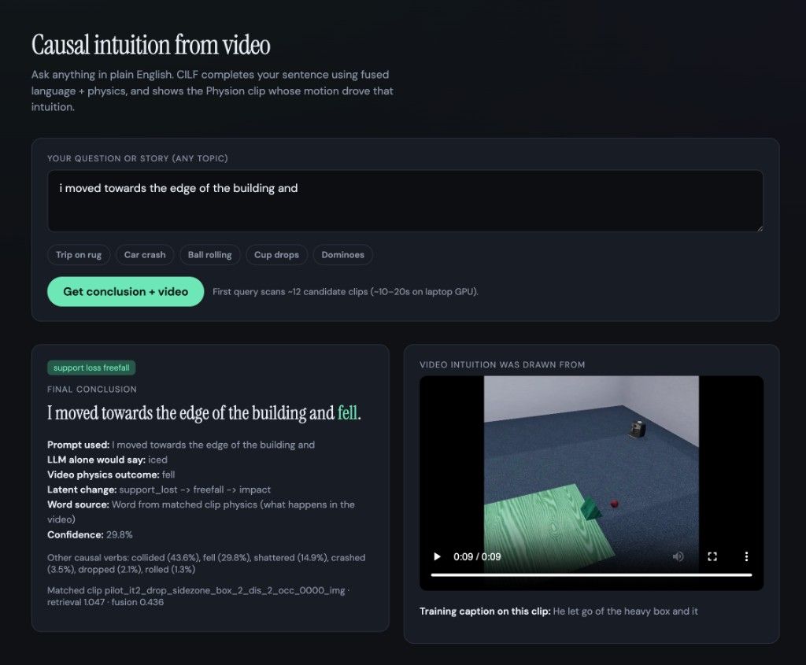
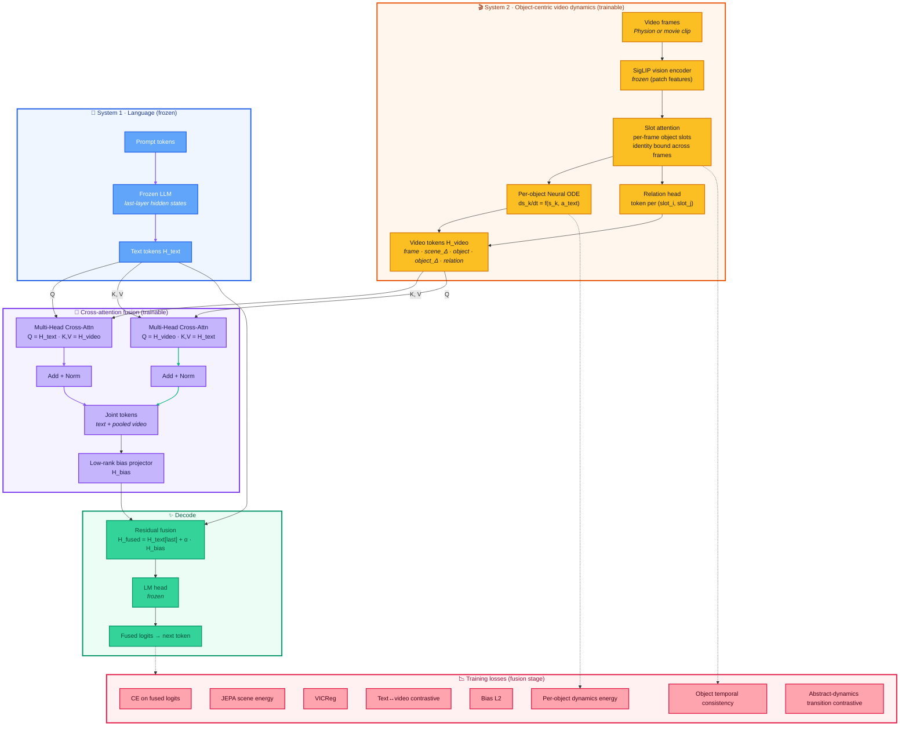

# CLIF-GPT

<p align="center">
  
</p>

<p align="center"><em>Localhost demo (not hosted yet on any platform) — type any prompt (e.g. <code>i moved towards the edge of the building and</code>), get a physics-backed completion plus the source clip. Run with <code>python scripts/demo_localhost.py</code>.</em></p>

<p align="center">
  
  
  
  
</p>

Cross-attentive **C**ausal-**I**ntuitive **L**ogit **F**usion: frozen LLM + trainable, object-centric video dynamics for zero-shot kinetic transfer.

CILF couples a **frozen small LLM** (language context) with a **trainable video dynamics branch** that tracks individual objects across frames and learns their causal state changes. Text, frame, object, and per-object delta tokens interact through **bidirectional cross-attention**; a low-rank projector turns the joint representation into a **hidden-space bias** that steers the LM head on novel English prompts — without per-video lookup.

## What the model actually learns

The thesis is simple: a movie is more than a caption and more than the visible scene. The interesting structure is the **latent causal state change driving the scene**, expressed per object, that should transfer to language situations the model has never seen.

| Layer | Example |
|------|---------|
| Surface caption | "a domino chain falls" |
| Visible scene | frames of stacked tiles, then tilted tiles, then ground impact |
| Object-centric state | tile_1 upright → tilted → fallen; tile_2 upright → tilted → fallen; ... |
| Causal transition | "support lost → accelerating downward → impact" |
| Zero-shot transfer | "I tripped on the rug and ___" → fell |

The model is asked to internalize the causal transition, not the caption-to-label map. The same checkpoint should lift rank on unseen prompt-video pairs whenever the underlying dynamics line up with the narrative.

## Architecture

Block flow (Transformer-style: **video dynamics** ≈ encoder, **frozen LLM** ≈ decoder, **cross-attention** fuses them before a single LM head):



**Equations**

```text
patch_features   = vision_backbone(frames)                     # [B, T, P, D]
slot_traj[t, k]  = SlotAttention(patch_features[t], slot_traj[t-1, k])
obj_current[k]   = mean_t slot_traj[:T-1, k]
obj_predicted[k] = ODE(obj_current[k], action = text_to_action(H_text))
obj_delta[k]     = obj_predicted[k] - obj_current[k]
rel_token[i,j]   = MLP(obj_pool[i], obj_pool[j], obj_delta[i], obj_delta[j])

H_video  = concat(frame_tokens, scene_delta, object_tokens, object_delta_tokens, relation_tokens)
H_text'  = LayerNorm(H_text  + CrossAttn(Q=H_text,  K/V=H_video))
H_video' = LayerNorm(H_video + CrossAttn(Q=H_video, K/V=H_text))
H_joint  = combine(H_text', pooled H_video')
H_bias   = LowRankProjector(concat(H_joint, pooled_video))
H_fused  = H_text[last] + α · H_bias[last]
logits   = lm_head(H_fused)
```

**Training stages**

1. **JEPA pretrain** — energy / trajectory losses on video latent dynamics (`ode` predictor).
2. **CILF fusion** — joint loss:
   - CE on fused logits (language grounding)
   - JEPA scene-level energy + VICReg
   - text↔video contrastive alignment + bias L2
   - **object temporal consistency** (InfoNCE: slot k at t+1 close to slot k at t)
   - **per-object dynamics energy** (predicted next slot state vs observed, hard-negatives across batch)
   - **abstract-dynamics transition contrastive** (clips that share an `abstract_dynamics` label pull together in the causal-bias space; clips with different abstract dynamics push apart)

Object tracking is gated by the `model.use_object_tracking` flag in the config and is on by default.

## Repository layout

```text
cilf/
  model.py            # CILFModel, CrossAttentionFusionBlock, vision + dynamics, detector-track path
  losses.py           # Energy, VICReg, alignment, bias regularization, object losses
  objects.py          # SlotAttention object tracker + RelationHead
  roi_features.py     # Patch-grid ROI pooling that turns detector boxes into per-object features
  track_io.py         # Per-clip object-track JSON read/write + tensor projection
  detector_tracks.py  # YOLO + ByteTrack adapter (real-world video)
  physion_detector.py # Motion-based detector for Physion's rendered primitives
  train.py            # Two-stage training loop
  data.py             # GeneralCausalVideoDataset (JSONL manifests, frames + optional precomputed tracks)
  vocab.py            # Full or bounded target vocab
  video_io.py         # Frame loading
  dynamics/ode.py

configs/cilf.yaml
data/
  physion/              # Physion videos (place or symlink here)
  kinetic_transfer/     # Train / val / transfer manifests

scripts/
  setup_venv.sh
  run_physion_pipeline.sh        # End-to-end driver: download + manifests + tracks + train + eval
  download_physion.py            # Download PhysionTest-Core / PhysionTrain-Dynamics
  build_kinetic_transfer_manifests.py
  precompute_yolo_tracks.py      # Precompute per-clip object tracks (Physion blob detector / YOLO+ByteTrack)
  prove_transfer.py
  evaluate_causal_transfer.py    # Causal transfer + embedding metrics
  demo_yolo_camera.py            # Live webcam: Ultralytics YOLO / YOLO-World detection
  demo_object_tracking_camera.py # Live webcam: CLIF slot-attention tracking

tests/
  test_object_tracking.py        # End-to-end smoke test for slot-attention path
  test_detector_tracks.py        # Smoke test for ROI pooling + detector-tracks path
  test_physion_pipeline.py       # End-to-end Physion clip + tracks + model fwd/bwd
```

## Manifest schema

Manifests are JSONL. The minimum required fields are `video_path`, `prompt`, and `causal_consequence`. The schema is purposefully permissive so you can add richer causal annotations as you generate them.

| Field | Purpose | Required |
|------|--------|----------|
| `video_path` | Relative or absolute path to the clip | yes |
| `prompt` | Narrative context (frozen LLM input) | yes |
| `causal_consequence` | Expected next-token / outcome word | yes |
| `causal_trigger` | Boolean: this clip actually has a causal contact event | no |
| `scenario` | Free-form scenario label | no |
| `stim_id` | Stable identifier for the clip | no |
| `abstract_dynamics` | Hidden-meaning label (e.g. `support_loss_freefall`, `momentum_transfer_collision`) — used for transition contrastive loss and hard negatives | no |
| `objects` | List of object names visible in the clip | no |
| `subject_object` | Name of the object that initiates the change | no |
| `affected_object` | Name of the object that undergoes the change | no |
| `interaction` | One-line description of the causal contact (e.g. `ball hits cup`) | no |
| `precondition` | World state before the change (e.g. `cup on table`) | no |
| `postcondition` | World state after the change (e.g. `cup on floor`) | no |
| `causal_state_change` | Free-form description of the latent transition (e.g. `support lost -> freefall -> impact`) | no |
| `counterfactual_prompt` | Alternative prompt where the same dynamics should still apply | no |
| `tracks` | Optional per-frame, per-object bbox / keypoint tracks (for real-movie ingestion) | no |

## Setup

```bash
bash scripts/setup_venv.sh
source .venv/bin/activate
pip install -e ".[detect]"
```

Place Physion clips under `data/physion/` (paths in manifests are relative to each manifest file).

## Quickstart: Physion → object tracks → zero-shot reasoning

Everything below is wired up so you can go from "no data" to a trained, zero-shot-evaluating CILF in one command:

```bash
scripts/run_physion_pipeline.sh
```

Under the hood the driver does four things:

1. **Downloads PhysionTest-Core** (~270 MB) via `scripts/download_physion.py`. Re-runs are idempotent. Add `SPLIT=both` to also pull the 770 MB train-dynamics split.
2. **Builds manifests** via `scripts/build_kinetic_transfer_manifests.py`. Each Physion scenario is paired with multiple narrative prompts that share the same `abstract_dynamics` label (e.g. `support_loss_freefall`), plus a `transfer` manifest with held-out narrative phrasings.
3. **Precomputes object tracks** via `scripts/precompute_yolo_tracks.py --detector physion`. Physion's rendered primitives defeat YOLO-World, so the default detector is a motion-based + connected-components tracker (`cilf/physion_detector.py`) that builds a robust median background and tracks moving blobs across frames with greedy IoU. Real-world video should use `--detector yolo` which calls Ultralytics YOLO-World + ByteTrack.
4. **Trains CILF with detector-track ROI features and per-object dynamics** using `configs/cilf_physion.yaml`, then evaluates zero-shot causal transfer with `scripts/evaluate_causal_transfer.py`.

Manually, the same flow is:

```bash
python scripts/download_physion.py --split test --dest data/physion
python scripts/build_kinetic_transfer_manifests.py --physion-root data/physion/Physion
python scripts/precompute_yolo_tracks.py \
  --manifest data/kinetic_transfer/manifest_kinetic_train.jsonl \
  --tracks-dir data/kinetic_transfer/tracks \
  --detector physion
python -m cilf.train --config configs/cilf_physion.yaml --override max_steps=500
python scripts/evaluate_causal_transfer.py \
  --config configs/cilf_physion.yaml \
  --manifest data/kinetic_transfer/manifest_kinetic_transfer.jsonl
```

### Office laptop (Homebrew + blocked Hugging Face)

Corporate Wi‑Fi often stalls large Hub downloads (~400 MB SigLIP weights). Use Homebrew’s CLI and train on tracks immediately:

```bash
brew install hf git-lfs
scripts/setup_models_brew.sh          # optional: export HF_TOKEN=hf_... first
scripts/train_physion_tracks.sh       # auto-picks office vs full SigLIP config
```

If `model.safetensors` is missing, training uses `configs/cilf_physion_office.yaml` (trainable conv encoder + precomputed tracks). After SigLIP lands under `models/siglip-base-patch16-224/`, re-run the same train script for full vision.

### Localhost Q&A demo (conclusion + source video)

Ask a new question in the browser; CILF retrieves the closest Physion clip, runs fusion on your prompt + that video, and returns the **final sentence** plus the **mp4** the intuition came from.

```bash
pip install flask
python scripts/demo_localhost.py
# open http://127.0.0.1:8765
```

Options: `--checkpoint`, `--manifest`, `--candidates 12`, `--port 8765`.

### How detector tracks feed the model

Each precomputed track JSON stores normalized `[x1, y1, x2, y2]` boxes per frame per track id. The dataset projects them onto the same temporal grid that the vision encoder sees, and the model uses **ROI pooling on SigLIP patch features** (`cilf.roi_features.roi_pool_patches`) to compute one feature per (track, frame) pair. Those features feed the **same per-object dynamics module and relation head** that slot attention used to drive, so swapping detectors changes the source of object identity but not the downstream architecture or loss terms.

When a clip has no precomputed tracks the model falls back to slot attention automatically — both pathways coexist behind the `use_object_tracking` and `use_detector_tracks` flags in the config.

### Visualize clips, bounding boxes, and training subsamples

```bash
python scripts/visualize_physion_dataset.py --limit 6
python scripts/visualize_physion_dataset.py --stim-id pilot_dominoes_4mid_boxroom_2_0002_img --training-view
```

Writes to `demo_outputs/vis/`:

| Output | What it shows |
|--------|----------------|
| `dataset_overview.png` | One mid-frame per scenario (Collide, Drop, Dominoes, …) with all track boxes |
| `<stim_id>_grid.png` | 8-panel contact sheet across the clip timeline |
| `<stim_id>.mp4` | Full annotated video (colored box per track id + label + confidence) |
| `<stim_id>_training.png` | Subsampled 224×224 frames + boxes exactly as `GeneralCausalVideoDataset` loads them |

## Data manifests

```bash
python scripts/build_kinetic_transfer_manifests.py
```

Produces `data/kinetic_transfer/manifest_kinetic_{train,val,transfer}.jsonl` pairing videos with narrative prompts and kinetic target words.

## Train

```bash
cilf-train --config configs/cilf_physion.yaml
```

Checkpoints are written to `runs/cilf_physion/`. For a full run, set `training.stage` to `jepa_pretrain` first (same config), then `cilf_fusion` with `checkpoint_path` pointing at the JEPA checkpoint.

## Evaluate transfer

```bash
python scripts/prove_transfer.py \
  --config configs/cilf.yaml \
  --manifest data/kinetic_transfer/manifest_kinetic_transfer.jsonl
```

For richer reporting (next-token accuracy, fused-vs-LLM rank lift, abstract-dynamics retrieval, embedding clustering) run:

```bash
python scripts/evaluate_causal_transfer.py \
  --config configs/cilf.yaml \
  --manifest data/kinetic_transfer/manifest_kinetic_transfer.jsonl
```

## Design intent

Video teaches **amortized causal intuition** (object tracking + per-object dynamics + cross-attention), not a memorized label per clip. The same checkpoint should lift rank on **unseen** prompt–video pairs whenever the underlying object-level dynamics line up with the narrative (e.g. domino collapse → `fell` / `shattered` depending on α and context).

The supervision design treats the **abstract dynamics** (e.g. `support_loss_freefall`) as the invariant the model must internalize. Two clips with identical abstract dynamics and totally different objects should still produce nearby causal-bias vectors; clips with different abstract dynamics should not.

After changing fusion architecture or object tokens, retrain from scratch; older checkpoints are not weight-compatible.

## Why dedicated transition tokens (and not a single state-delta token)

The baseline CLIF design fed one `state_delta` token to the fusion block. That worked for "what changed in the scene as a whole," but it has three structural problems:

1. **It blends every moving object into one vector.** A scene with a ball striking a cup and a cup falling becomes one averaged change, not "ball moved" + "cup lost support" + "ball acted on cup."
2. **It can only express one kind of change.** There is no place to encode object identity, per-object velocity, or which object caused which.
3. **The fusion block has to recover token semantics from order.** With many object/relation tokens added, the model would have to learn purely from position which token is a frame, which is a delta, and which is a relation.

The current model addresses all three:

- The video token sequence carries **frame tokens**, **a scene-delta token** (kept as the baseline summary), **per-object pooled tokens**, **per-object delta tokens**, and **pairwise relation tokens**.
- Each kind of token is tagged with a **learned token-type embedding** so cross-attention can route queries to "which object" or "what relation" independently of the order in which tokens were concatenated.
- The losses correspondingly supervise the new structure: object temporal consistency keeps slot identity stable across frames, per-object dynamics energy supervises per-object next-state prediction, and the abstract-dynamics transition contrastive pulls clips with the same hidden meaning together regardless of object or caption.

The single state-delta token is therefore now a **baseline summary**, not the only transition representation.
