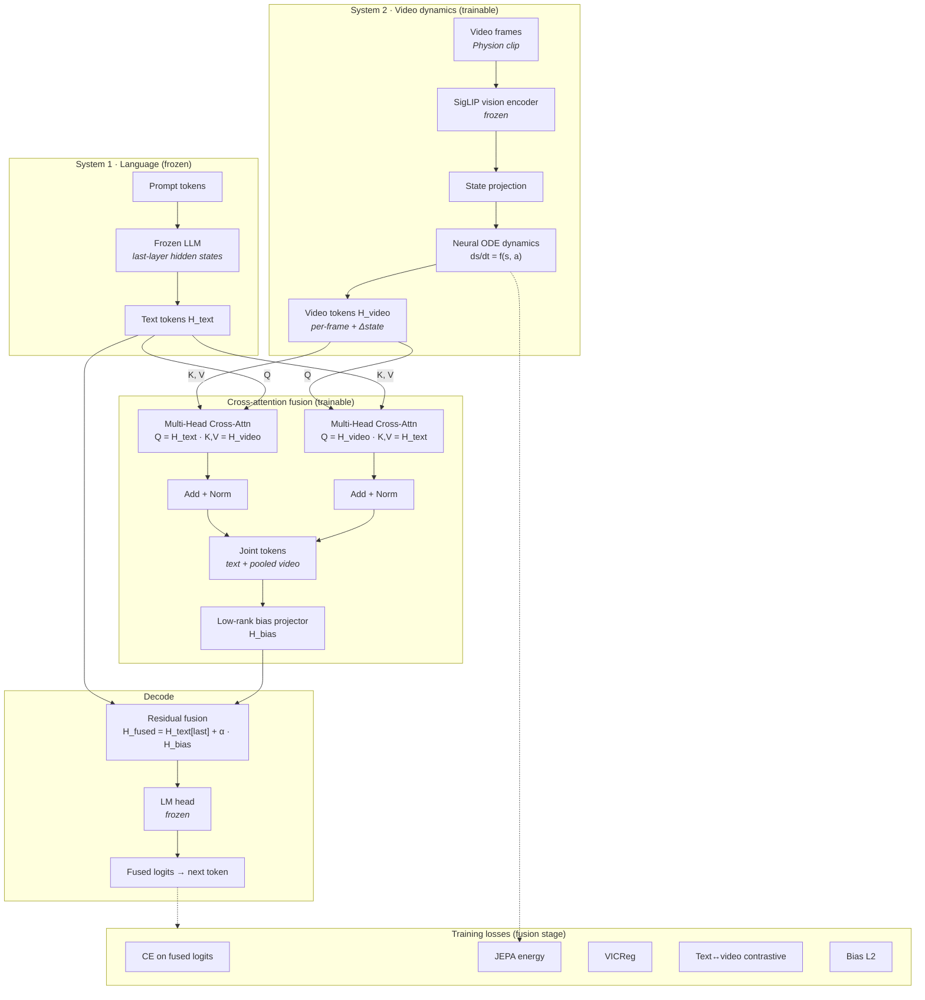

# CLIF-GPT

Cross-attentive **C**ausal-**I**ntuitive **L**ogit **F**usion: frozen LLM + trainable video dynamics for zero-shot kinetic transfer.

CILF couples a **frozen small LLM** (language context) with a **trainable video dynamics branch** (Physion-style causal intuition). Text and video token sequences interact through **bidirectional cross-attention**; a low-rank projector turns the joint representation into a **hidden-space bias** that steers the LM head on novel English prompts—without per-video lookup.

## Architecture

Block flow (Transformer-style: **video dynamics** ≈ encoder, **frozen LLM** ≈ decoder, **cross-attention** fuses them before a single LM head):



**Equations**

```text
H_text'  = LayerNorm(H_text  + CrossAttn(Q=H_text,  K/V=H_video))
H_video' = LayerNorm(H_video + CrossAttn(Q=H_video, K/V=H_text))
H_joint  = combine(H_text', pooled H_video')
H_bias   = LowRankProjector(concat(H_joint, pooled_video))
H_fused  = H_text[last] + α · H_bias[last]
logits   = lm_head(H_fused)
```

**Training stages**

1. **JEPA pretrain** — energy / trajectory losses on video latent dynamics (`ode` predictor).
2. **CILF fusion** — joint loss: CE on fused logits + JEPA energy + VICReg + text↔video contrastive alignment + bias L2.

## Repository layout

```text
cilf/
  model.py      # CILFModel, CrossAttentionFusionBlock, vision + dynamics
  losses.py     # Energy, VICReg, alignment, bias regularization
  train.py      # Two-stage training loop
  data.py       # GeneralCausalVideoDataset (JSONL manifests)
  vocab.py      # Full or bounded target vocab
  video_io.py   # Frame loading
  dynamics/ode.py

configs/cilf.yaml
data/
  physion/              # Physion videos (place or symlink here)
  kinetic_transfer/     # Train / val / transfer manifests

scripts/
  setup_venv.sh
  build_kinetic_transfer_manifests.py
  prove_transfer.py
  demo_usp_transfer.py
```

## Setup

```bash
bash scripts/setup_venv.sh
source .venv/bin/activate
pip install -e ".[demo]"   # optional: Gradio dashboard
```

Place Physion clips under `data/physion/` (paths in manifests are relative to each manifest file).

## Data manifests

```bash
python scripts/build_kinetic_transfer_manifests.py
```

Produces `data/kinetic_transfer/manifest_kinetic_{train,val,transfer}.jsonl` pairing videos with narrative prompts and kinetic target words.

## Train

```bash
cilf-train --config configs/cilf.yaml
```

Checkpoints are written to `runs/cilf/`. For a full run, set `training.stage` to `jepa_pretrain` first (same config), then `cilf_fusion` with `checkpoint_path` pointing at the JEPA checkpoint.

## Evaluate transfer

```bash
python scripts/prove_transfer.py \
  --config configs/cilf.yaml \
  --manifest data/kinetic_transfer/manifest_kinetic_transfer.jsonl
```

## Demo

```bash
python scripts/demo_usp_transfer.py
```

Open http://127.0.0.1:7860 — upload a Physion clip, enter a held-out prompt, and compare LLM-only vs video vs fused kinetic distributions.

## Design intent

Video teaches **amortized causal intuition** (dynamics + cross-attention), not a memorized label per clip. The same checkpoint should lift rank on **unseen** prompt–video pairs when the dynamics match the narrative (e.g. domino collapse → `fell` / `shattered` depending on α and context).

After changing fusion architecture, retrain from scratch; older checkpoints are not weight-compatible.
